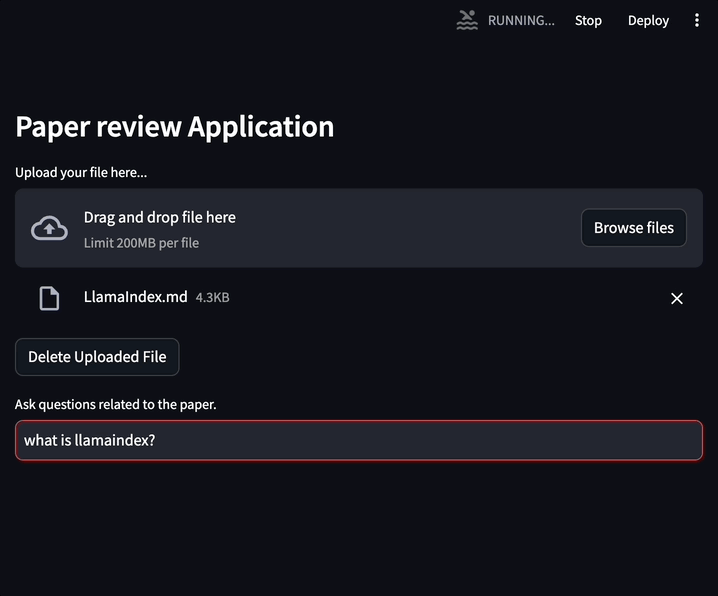

# paper-reviewer
paper-review service using `LlamaIndex`, `ChatGPT`

## quick start
1. write `.env` and paste your OpenAI API Key
    ```env
    # paste your OpenAI API Key here
    OPENAI_API_KEY=
    ```
2. run script to start server
    ```sh
    sh start.sh
    ```

## use screen
<details>
<summary>see details</summary>

### upload file


### send query and get answer from ChatGPT

</details>
